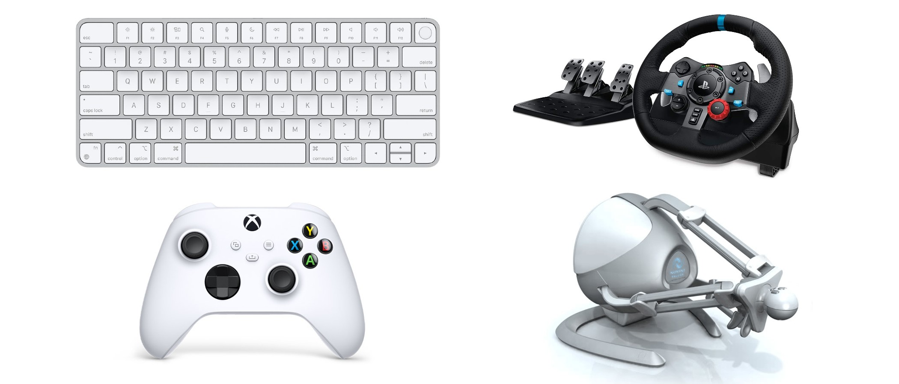

# Mobile_Robot_ROS_Control_Interfaces
This package implements ROS teleoperation interfaces for controlling the mobile robots. Interfaces include the keyboard, joystick, steering wheel G29, and Novint Falcon.

## Dependencies

`git clone --recurse-submodules git@github.com:hiro-wpi/Mobile_Robot_ROS_Control_Interfaces.git ` 

If you do not need any of these interfaces, you could simply delete its corresponding folders to avoid build error.

- To use Keyboard, TODO
- To use Joystick, TODO
- To use Falcon Novint, please follow the [falcon interface README](ros_falcon_interface/README.md) to set it up.
- To use G29 Steering Wheel force feedback, please follow the [g29 force feedback README](ros-g29-force-feedback/README.md) for configuration.

## Run the controllers

You can specify the published topic names in the command or you could change the default topic name in launch files.

This package includes keyboard and mouse controller for teleoperating mobile robot. You could control the wheels with keyboard and cameras with mouse.

- `roslaunch keyboard_control TODO  ` 

- `roslaunch joystick_control TODO`
- `roslaunch falcon_control`
- `roslaunch g29_steering_wheel_control`

For more details, please refer to the README files in each folder.

